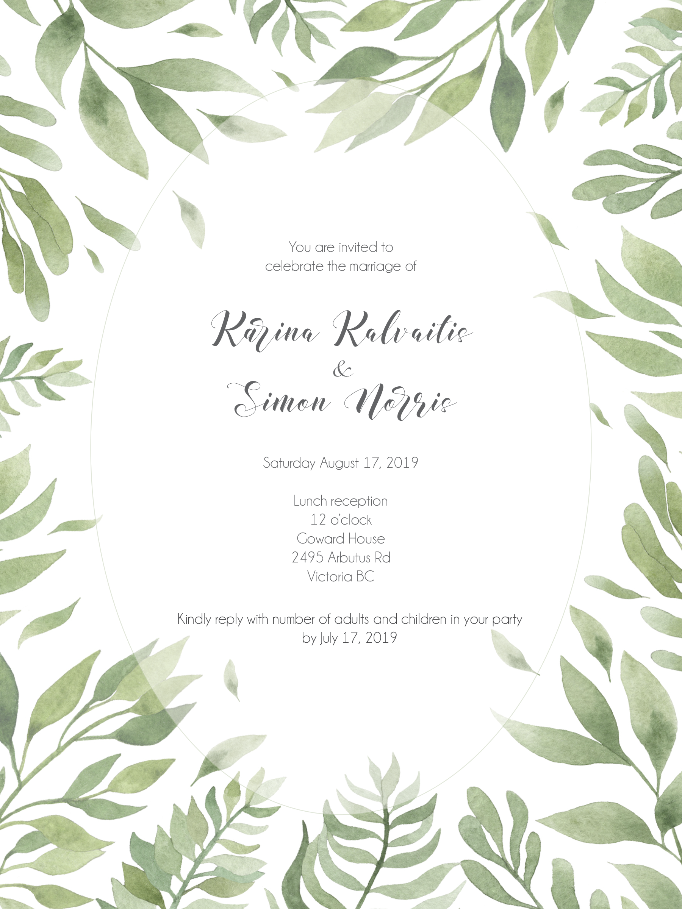

### What to expect:
A casual summer reception with drinks, lunch, lawn games and dancing. Noon to 4 p.m.

### What to Wear:
Goward House is a large heritage home located in a six-acre urban woodland with a large lawn and looped paths to explore. Formal attire is not required! Feel free to dress in whatever makes you feel good. Karina will be wearing a summer dress and Simon promises to be wearing shorts.

### Registry:
We are so happy that you’ll be able to join us for our wedding reception. As many of you know, we live in a small house, and it is already filled with all the things we need to make it a home. Gifts are in no way expected or required but for those who have expressed an interest in offering a gift we would gratefully accept donations toward our kitchen renovation fund.

### Directions:
There is a parking lot in the front as well as street parking. Directions here:

